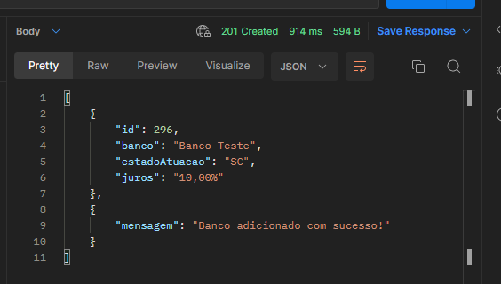
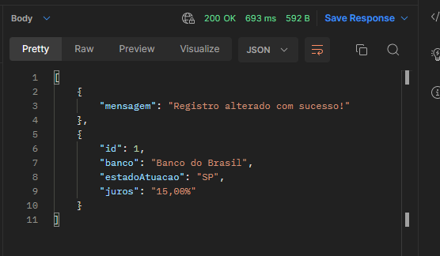

# Relatório de Erros e Sugestões API Bank - Serasa  

Relatório de BUGs e melhorias encontrados na API Bank, entendo que a API tem respostas pré definidas para facilitar o desenvolvimento do teste, mas nesse relatório informarei cenários como se fosse uma aplicação real, considerando que os dados precisariam ser tratados individualmente

## Cenários de BUGS
    
### **Cenário:** *200 - Sucesso filtro por "Estado"*
> **FEATURE:**  
GET /bank  
  
> **CRITICIDADE:**  
ALTA  
  
> **DESCRIÇÃO:**  
Ao informar um filtro no *query param*: estadoAtuacao, o mesmo devolve sempre o mesmo array de objetos como se os filtros fossem de "SC".
  
### **Cenário:** *400 - Filtros com Tipagem inválida*
> **FEATURE:**  
GET /bank  
  
> **CRITICIDADE:**  
MÉDIA  
  
> **DESCRIÇÃO:**  
Ao informar no *query param*: estadoAtuacao um value em de tipagem inválida, o endpoint não faz a tratativa do erro, e retorna status 200.  
  
### **Cenário:** *400 - Filtros em branco*
> **FEATURE:**  
GET /bank  
  
> **CRITICIDADE:**  
MÉDIA  
  
> **DESCRIÇÃO:**  
Ao informar no *query param*: estadoAtuacao um value em branco, o endpoint não faz a tratativa do erro, e retorna status 200.  
  
### **Cenário:** *401 - Autenticação inválida*
> **FEATURE:**  
GET /bank  
  
> **CRITICIDADE:**  
ALTA  
  
> **DESCRIÇÃO:**  
O endpoint não está validando a autenticação enviada, ele devolve 200 mesmo com TOKEN inválido ou inexistente.
  
### **Cenário:** *200 - Sucesso Atualização Parcial/200 - Sucesso Atualização Completa *
> **FEATURE:**  
PUT /bank{id}  
  
> **CRITICIDADE:**  
ALTA  
  
> **DESCRIÇÃO:**  
Ao informar atualizar parcial ou completamente um registro de banco, o response retorna sempre da mesma forma.
  
### **Cenário:** *400 - Campos com Tipagem inválida*
> **FEATURE:**  
PUT /bank{id}
  
> **CRITICIDADE:**  
MÉDIA  
  
> **DESCRIÇÃO:**  
Ao informar no *body* campos com tipagem inválida, o endpoint não faz a tratativa do erro, e retorna status 200.  
  
### **Cenário:** *400 - Campos em branco*
> **FEATURE:**  
PUT /bank{id}
  
> **CRITICIDADE:**  
MÉDIA  
  
> **DESCRIÇÃO:**  
Ao informar no *body* campos em branco, o endpoint não faz a tratativa do erro, e retorna status 200.  

  
### **Cenário:** *401 - Autenticação inválida*
> **FEATURE:**  
PUT /bank{id}
  
> **CRITICIDADE:**  
ALTA  
  
> **DESCRIÇÃO:**  
O endpoint não está validando a autenticação enviada, ele devolve 200 mesmo com TOKEN inválido ou inexistente.
  
### **Cenário:** *201 - Sucesso Cadastro*
> **FEATURE:**  
POST /bank  
  
> **CRITICIDADE:**  
ALTA  
  
> **DESCRIÇÃO:**  
Ao cadastrar um novo banco, o response retorna sempre o mesmo objeto.
  
### **Cenário:** *400 - Cadastro com Tipagem inválida*
> **FEATURE:**  
POST /bank
  
> **CRITICIDADE:**  
MÉDIA  
  
> **DESCRIÇÃO:**  
Ao informar no *body* campos com tipagem inválida, o endpoint não faz a tratativa do erro, e retorna status 200.  
  
### **Cenário:** *400 - Campos em branco*
> **FEATURE:**  
POST /bank
  
> **CRITICIDADE:**  
MÉDIA  
  
> **DESCRIÇÃO:**  
Ao informar no *body* campos em branco, o endpoint não faz a tratativa do erro, e retorna status 200.  

  
### **Cenário:** *401 - Autenticação inválida*
> **FEATURE:**  
POST /bank
  
> **CRITICIDADE:**  
ALTA  
  
> **DESCRIÇÃO:**  
O endpoint não está validando a autenticação enviada, ele devolve 200 mesmo com TOKEN inválido ou inexistente.

## Sugestões e Melhorias

- Acrescentei como sugestão um endpoint GET /bank/{id}, é possivel ver o funcionamento no swagger;
- Acrescentar no GET /bank os filtros por: Banco e Juros;
- Incluir tratativa de 404 quando passar ID inválido no endpoint PUT /bank/{id};
- Padronização das tratativas de mensageria;
EX:  
  
  